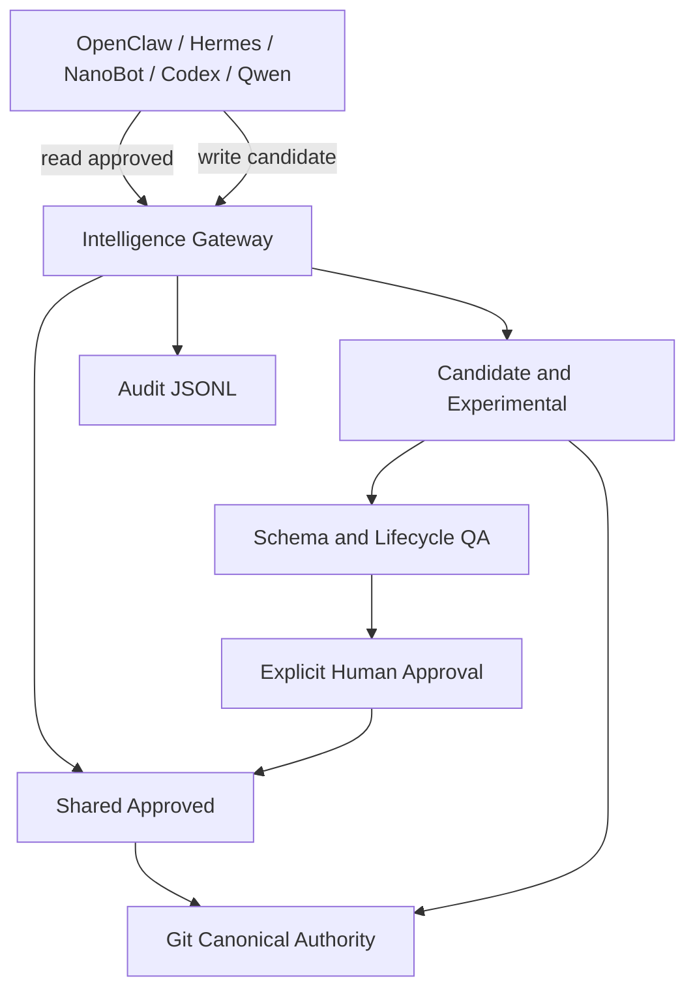

# Phase 1 Architecture

The Gateway is a governance boundary, not an Agent Runtime. It does not plan,
route models, schedule jobs, execute tools, or store private memory.

## Actual Phase 1 boundaries

- Filesystem repository: `AI_Platform/intelligence`.
- Canonical persistence: Git-tracked JSON and Markdown.
- Runtime API: Python `IntelligenceGateway`.
- Search: bounded substring search over local artifacts.
- Audit: append-only JSONL in `qa/audit.jsonl`.
- OpenViking: no adapter implementation and no production connection.
- MCP: no production server and no OpenClaw connection.
